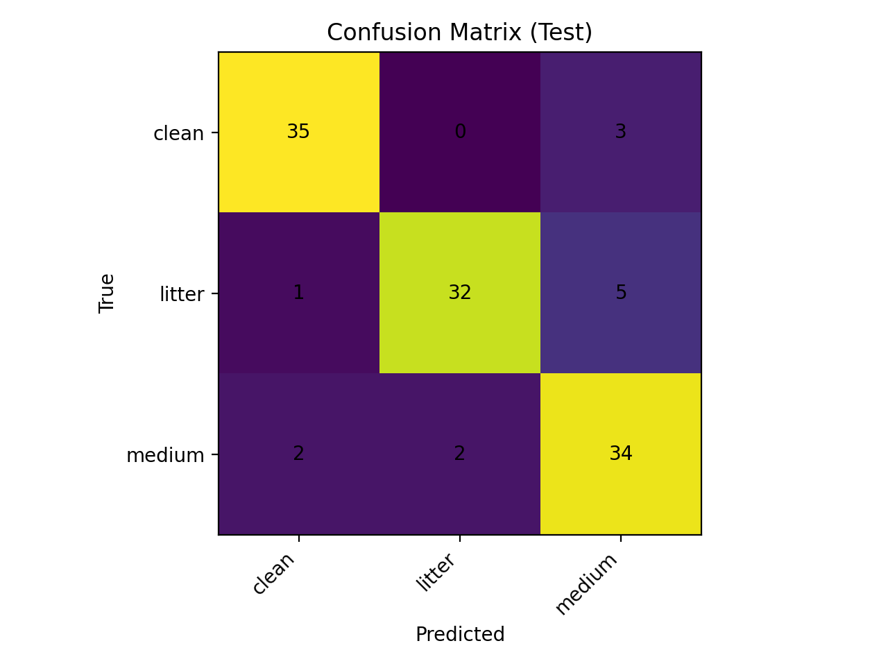
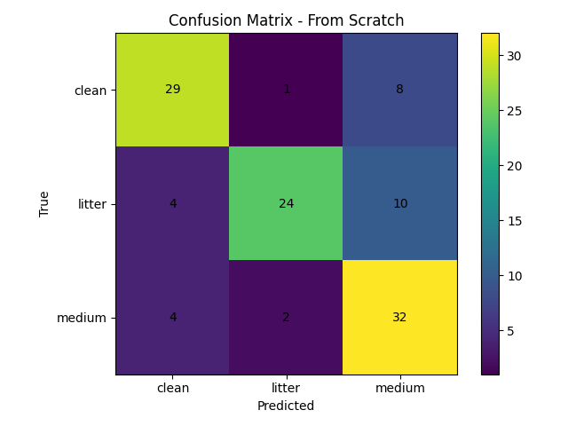

# Urban Cleanliness Classification (Clean / Medium / Litter)
## Project idea

This project aims to develop an automated system for classifying urban street images into three cleanliness categories: Clean, Medium, and Litter. The objective is to investigate whether transfer learning using a pretrained ResNet-18 model improves performance compared to training the same architecture from scratch on a relatively small dataset. In addition to quantitative evaluation using accuracy and macro F1-score, the project incorporates Grad-CAM to visualize and interpret the model’s decision-making process. By combining performance comparison and explainability analysis, the study explores both predictive accuracy and transparency in urban cleanliness classification.

### Labeling Criteria

Clean:
- No visible litter on the ground
- Pavement/road appears tidy

Medium:
- Small scattered litter
- Trash bins may be present
- Litter does not dominate the scene

Litter:
- Multiple visible waste items
- Garbage piles or widespread trash
- Litter visually dominates the ground

Labels reflect human perception and are subjective.

Classify urban street images into **Clean**, **Medium**, and **Litter** using a CNN (ResNet-18).  
This project compares **transfer learning (pretrained on ImageNet)** vs **training from scratch**, and uses **Grad-CAM** for explainability.

---

## Project Overview
- **Task:** 3-class image classification (Clean / Medium / Litter)
- **Models:**
  - ResNet-18 (Pretrained, fine-tuned in 2 phases)
  - ResNet-18 (From scratch)
- **Explainability:** Grad-CAM heatmaps for correct and misclassified samples

---

## Dataset Drescription
- **Source:** [Kaggle Street Classification Dataset](https://www.kaggle.com/datasets/nw8vglafd/street-classification-dataset)

- **Processed dataset:** - download it from the source and reorganized manually into 3 classes as it contain some extra data also.Seperated the medium liiter images from more litter ones and created seperate class for it. 
   
    **Download:**  
  [Google Drive Link](https://drive.google.com/drive/folders/12ojbFjkev9edPna561bLI7ngTk-tWnJ4)

- **Total images:** 750 (balanced)
- **Per class:** 250 images each
- **Split:** 70% train / 15% val / 15% test

---

## Repository Structure

```text
URBAN_CLEANLINESS/
├── data_split/
│   ├── train/
│   ├── val/
│   └── test/
│
├── figures/
│   └── gradcam/
│       ├── correct/
│       └── wrong/
│
├── gradcam_samples/
│   ├── correct/
│   └── wrong/
│
├── results/
│   ├── pretrained_classification_report.txt
│   ├── pretrained_confusion_matrix.png
│   ├── scratch_classification_report.txt
│   └── scratch_confusion_matrix.png
│
├── scripts/
│   ├── find_misclassified.py
│   ├── gradcam_resnet18.py
│   ├── split_dataset.py
│   ├── train_baselineA_resnet18.py
│   └── train_from_scratch_resnet18.py
│
├── .gitignore
└── README.md
```
---

## Methodology
## Pretrained Model: ResNet-18 (Transfer Learning)

We use **ResNet-18 pretrained on ImageNet** as the primary baseline model. 
Instead of training from random initialization, we leverage learned visual features from a large-scale dataset (ImageNet) and adapt them to the urban cleanliness task.

### Why Pretrained?
ResNet-18 pretrained on ImageNet already learns:
- Low-level features (edges, textures)
- Mid-level patterns (shapes, object parts)
- High-level semantic representations

This helps the model:
- Converge faster
- Perform better on small datasets
- Generalize better to unseen data

### Training Strategy (Two-Phase Fine-Tuning)

We fine-tune the model in **two phases**:

#### Phase 1 — Frozen Backbone
- Freeze all convolutional layers
- Train only the final fully connected (classification) layer
- Learning rate: 1e-3
- Purpose: Adapt classifier to 3 classes (Clean / Medium / Litter)

#### Phase 2 — Fine-Tuning
- Unfreeze the last residual block (layer4)
- Train layer4 + classifier
- Lower learning rate: 1e-4
- Purpose: Adapt high-level features to urban cleanliness domain

Model selection is based on **validation macro-F1 score**.

### Loss & Optimization
- Loss function: Cross-Entropy Loss
- Optimizer: Adam
- Regularization: Weight decay (1e-4)
- Learning rate scheduling: ReduceLROnPlateau (based on validation F1)

### Performance

| Metric | Value |
|--------|-------|
| Accuracy | 0.886 |
| Macro F1-score | 0.887 |

The pretrained model significantly outperforms the model trained from scratch, demonstrating the benefit of transfer learning for small datasets.

---

## From-Scratch Model: ResNet-18 (Random Initialization)

In this experiment, ResNet-18 was trained **from random initialization** without using ImageNet pretrained weights.  
This allows us to evaluate how well the model can learn urban cleanliness features purely from the available dataset.

### Why Train From Scratch?

Training from scratch means:
- All convolutional layers are randomly initialized
- The network must learn low-level and high-level features directly from the dataset
- No prior visual knowledge is transferred from ImageNet

This setup provides a fair comparison against the pretrained transfer learning approach.

### Model Configuration

- Architecture: ResNet-18
- Initialization: Random (`weights=None`)
- Output classes: 3 (Clean / Medium / Litter)

```python
model = models.resnet18(weights=None)
model.fc = nn.Linear(model.fc.in_features, 3)
```
### Training Setup

- Loss Function: Cross-Entropy Loss
- Optimizer: Adam
- Learning Rate: 1e-3
- Weight Decay: 1e-4
- Epochs: 40

Model Selection Criterion: Best Validation Macro-F1

Unlike the pretrained model, all layers were trained end-to-end from the beginning.

### performance

| Metric         | Value |
| -------------- | ----- |
| Accuracy       | 0.750 |
| Macro F1-score | 0.750 |

### Observations

- Performance is lower compared to the pretrained ResNet-18.
- Higher confusion between Medium and Litter classes.
- Convergence is slower due to lack of pretrained features.
- The dataset size is relatively small for training deep CNNs from scratch.

### Conclusion

Training from scratch demonstrates that the available dataset alone is not sufficient to learn highly discriminative features.
This highlights the effectiveness of transfer learning, especially for small to medium-sized image classification problems.


---

## Evaluation results

Model performance was evaluated on the held-out test set using Accuracy and Macro F1-score.  
Macro F1 is reported to ensure balanced evaluation across all three classes.

### Overall Performance Comparison

| Model | Accuracy | Macro F1-score |
|--------|----------|---------------|
| ResNet-18 (Pretrained) | 0.886 | 0.887 |
| ResNet-18 (From Scratch) | 0.750 | 0.750 |

The pretrained model significantly outperforms the model trained from scratch, demonstrating the effectiveness of transfer learning for small datasets.


## Pretrained ResNet-18 (Transfer Learning)

### Detailed Classification Report

| Class  | Precision | Recall | F1-score | Support |
|---------|-----------|--------|----------|----------|
| Clean   | 0.921 | 0.921 | 0.921 | 38 |
| Litter  | 0.941 | 0.842 | 0.889 | 38 |
| Medium  | 0.810 | 0.895 | 0.850 | 38 |

- Accuracy: **0.886**
- Macro Avg F1: **0.887**

### Confusion Matrix



**Observations:**
- Strong performance across all classes.
- Minor confusion between *Medium* and *Litter*.
- Clean class is classified very reliably.

---

## ResNet-18 (From Scratch)

### Detailed Classification Report

| Class  | Precision | Recall | F1-score | Support |
|---------|-----------|--------|----------|----------|
| Clean   | 0.78 | 0.76 | 0.77 | 38 |
| Litter  | 0.89 | 0.63 | 0.74 | 38 |
| Medium  | 0.64 | 0.84 | 0.73 | 38 |

- Accuracy: **0.750**
- Macro Avg F1: **0.750**

### Confusion Matrix



**Observations:**
- Higher confusion between *Medium* and *Litter* and also between *Medium* and *Clean*
- Lower recall for the Litter class.
- Training from scratch struggles to learn strong discriminative features.

## Key Insights

- Transfer learning improves performance by approximately **13.6% in accuracy**.
- Pretrained features help better distinguish subtle differences between Medium and Litter.
- From-scratch training requires more data to achieve comparable generalization.
- Grad-CAM analysis confirms that the pretrained model focuses more accurately on litter regions.

## Conclusion

The results clearly demonstrate that **transfer learning using pretrained ResNet-18 is more effective** than training from scratch for this dataset size.  
Leveraging ImageNet features enables better generalization and more stable class separation.

---

## Grad-CAM Explainability

To better understand how the model makes decisions, we applied **Gradient-weighted Class Activation Mapping (Grad-CAM)** to visualize spatial attention patterns.

Grad-CAM highlights the regions of an image that most strongly influence the model’s prediction by computing gradients with respect to the final convolutional layer.

### Why Grad-CAM?

- Verifies whether the model focuses on semantically meaningful regions.
- Helps interpret misclassifications.
- Provides transparency in CNN decision-making.
- Validates improvements from transfer learning.


### visualization Interpretation

Grad-CAM produces a heatmap overlay:

- 🔴 **Red/Yellow regions** → Strong influence on prediction  
- 🔵 **Blue regions** → Low contribution  

The intensity (not the specific color) represents the relative importance of that region in influencing the final decision.


---

### Correct Predictions

In correctly classified images, activation maps show:

- Strong attention on ground-level clutter for the *Litter* class.
- Focused attention on uniform pavement for the *Clean* class.
- Moderate spatial activation for *Medium* class.


```text
figures/gradcam/correct/
```
#### Example - litter predicted as litter 


#### Where Is the Model Focusing?

The model is strongly activated on:

- Foreground debris pile

- Broken objects on the ground

- Large trash items

- Central cluttered region

The building facade and upper area receive much less activation.

This is correct behavior.

### Observation:
The pretrained model consistently concentrates activation on relevant visual cues, indicating meaningful feature learning.

### Misclassifications

Misclassified samples reveal boundary ambiguity between classes.

Example:

```text
figures/gradcam/wrong/
```
#### Example - litter predicted as medium


#### why it is predicted as Medium?
 
 ### Misclassification Example (Litter → Medium)

In this example, the model predicts *Medium* instead of *Litter*. 
Grad-CAM highlights the central trash pile, indicating that the model correctly identifies clutter regions. 
However, since the litter is spatially concentrated rather than widely dispersed, the model likely interprets the severity as moderate.

This suggests that classification errors occur near the boundary between Medium and Litter classes, reflecting inherent labeling ambiguity rather than random model behavior.

### Common Patterns Observed

- Medium and Litter classes show overlapping activation regions.

- Some misclassifications occur when clutter is small or spatially dispersed.

### Key Insights from Explainability

- The pretrained model produces more concentrated and stable attention maps.

- Medium class exhibits the highest visual ambiguity.

- Errors are primarily due to class boundary overlap rather than random behavior.

- Grad-CAM confirms that transfer learning improves spatial focus.

### Conclusion

Grad-CAM analysis demonstrates that the pretrained ResNet-18 not only improves quantitative performance but also develops more meaningful and localized spatial representations.

This strengthens the validity of the model and provides interpretability beyond standard accuracy metrics.

## Set up
 
###  Running the code
 - Pretrained ResNet-18 (Transfer Learning)
 ```text
 python scripts/train_baselineA_resnet18.py
```
- Outputs saved in:

```text
runs/baselineA_resnet18/
```
- From-Scratch ResNet-18
```text
python scripts/train_from_scratch_resnet18.py
```
- Outputs saved in:

```text
runs/from_scratch_resnet18/
```
- Generate Grad-CAM Visualizations

```text
python scripts/gradcam_resnet18.py
```
- Outputs saved in:

```text
gradcam_samples/
```

## Limitations

- The dataset size is relatively small (750 images), which may limit generalization to diverse real-world scenarios.
- The boundary between Medium and Litter classes is subjective, leading to inherent ambiguity and classification overlap.
- Only ResNet-18 architecture was evaluated; other models were not explored.
- The system performs image-level classification and does not provide pixel-level segmentation or severity quantification.
- Grad-CAM provides approximate interpretability and does not fully explain the model’s internal reasoning.
- The model was evaluated offline and not tested in real-time deployment settings.

## Related work

Deep Convolutional Neural Networks (CNNs) have demonstrated strong performance in large-scale image recognition tasks. ResNet (He et al., 2016) introduced residual connections to enable deeper architectures without vanishing gradients and has become a widely adopted backbone for visual recognition problems.

Transfer learning using ImageNet-pretrained models has been shown to significantly improve performance in scenarios with limited training data. Fine-tuning pretrained CNNs allows models to reuse low-level and mid-level visual features learned from large datasets.

In the context of smart cities, computer vision techniques have been applied to tasks such as waste detection, urban monitoring, and environmental assessment. These systems aim to support automated cleanliness evaluation and resource allocation.

To improve model transparency, explainability methods such as Grad-CAM (Selvaraju et al., 2017) visualize spatial attention maps, helping interpret CNN decisions and validate model behavior.

## Poster Presentation

The project poster is available below:

 [Download Full Poster (PDF)](poster/poster_presentation.pdf)


